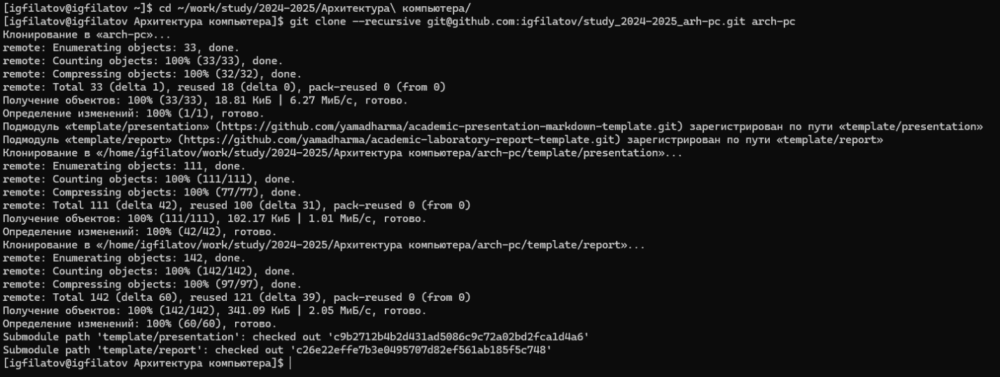
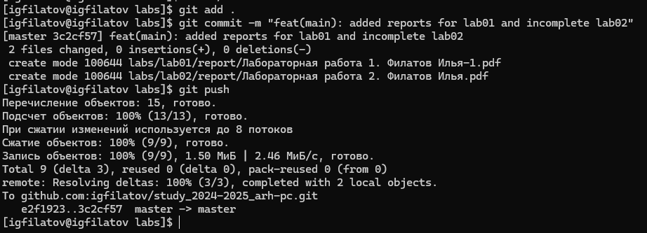

---
## Front matter
title: "Отчёт по лабораторной работе №2"
subtitle: "Дисциплина: Архитектура компьютера"
author: "Филатов Илья Гурамович"
 
## Generic otions
lang: ru-RU
toc-title: "Содержание"
 
## Bibliography
bibliography: bib/cite.bib
csl: pandoc/csl/gost-r-7-0-5-2008-numeric.csl
 
## Pdf output format
toc: true # Table of contents
toc-depth: 2
lof: true # List of figures
fontsize: 12pt
linestretch: 1.5
papersize: a4
documentclass: scrreprt
## I18n polyglossia
polyglossia-lang:
  name: russian
  options:
    - spelling=modern
    - babelshorthands=true
polyglossia-otherlangs:
  name: english
## I18n babel
babel-lang: russian
babel-otherlangs: english
## Fonts
mainfont: IBM Plex Serif
romanfont: IBM Plex Serif
sansfont: IBM Plex Sans
monofont: IBM Plex Mono
mathfont: STIX Two Math
mainfontoptions: Ligatures=Common,Ligatures=TeX,Scale=0.94
romanfontoptions: Ligatures=Common,Ligatures=TeX,Scale=0.94
sansfontoptions: Ligatures=Common,Ligatures=TeX,Scale=MatchLowercase,Scale=0.94
monofontoptions: Scale=MatchLowercase,Scale=0.94,FakeStretch=0.9
mathfontoptions:
## Biblatex
biblatex: true
biblio-style: "gost-numeric"
biblatexoptions:
  - parentracker=true
  - backend=biber
  - hyperref=auto
  - language=auto
  - autolang=other*
  - citestyle=gost-numeric
## Pandoc-crossref LaTeX customization
figureTitle: "Рис."
tableTitle: "Таблица"
listingTitle: "Листинг"
lofTitle: "Список иллюстраций"
lotTitle: "Список таблиц"
lolTitle: "Листинги"
## Misc options
indent: true
header-includes:
  - \usepackage{indentfirst}
  - \usepackage{float} # keep figures where there are in the text
  - \floatplacement{figure}{H} # keep figures where there are in the text
---
 
# Цель работы
 
Изучение идеологии и применения средств системы контроля версий (VCS) а также приобретение практических навыков по работе с системой git.
 
# Задание
 
1. Настройка github.
2. Базовая настройка git.
3. Создание SHH ключа.
4. Создание рабочего пространства и репозитория курса на основе шаблона.
5. Создание репозитория курса на основе шаблона.
6. Настройка каталога курса.
7. Задание для самостоятельной работы
 
# Выполнение лабораторной работы
 
## Настройка github
 
Создаю учётную запись на сайте https://github.com/ и заполняю основные данные (рис. [-@fig:001]).
 
{ #fig:001 width=70% }
 
## Базовая настройка git
 
Делаю предварительную конфигурацию git. Для этого открываю терминал и ввожу команды, указав имя и email владельца репозитория (рис. [-@fig:002]).
 
{ #fig:002 width=70% }
 
Настроим utf-8 в выводе сообщений git (рис. [-@fig:003]).
 
{ #fig:003 width=70% }
 
Задаю имя начальной ветки (рис. [-@fig:004]).
 
{ #fig:004 width=70% }
 
Параметр autocrlf (рис. [-@fig:005]).
 
{ #fig:005 width=70% }
 
Параметр safecrlf (рис. [-@fig:006]).
 
{ #fig:006 width=70% }
 
## Создание SSH ключа
 
Генерирую приватный и открытый ключи для последующей идентификации пользователя на сервере и копирую из локальной консоли ключ (рис. [-@fig:007]).
 
{ #fig:007 width=70% }
 
Загружаю скопированный открытый ключ на сайт http: //github.org/ (рис. [-@fig:008]).
 
{ #fig:008 width=70% }
 
## Создание рабочего пространства и репозитория курса на основе шаблона
 
Открываю терминал и с помощью команды mkdir и опции -p создаю иерархическую цепочку подкаталогов с каталогом для предмета «Архитектура компьютера» (рис. [-@fig:009]).
 
{ #fig:009 width=70% }
 
## Создание репозитория курса на основе шаблона
 
Создаю репозиторий на основе шаблона через web-интерфейс github. Перехожу на страницу репозитория с шаблоном курса и выбираю Use this template и Create a new repository (рис. [-@fig:010]).
 
{ #fig:010 width=70% }
 
В открывшемся окне задаю имя репозитория study_2023–2024_arhpc и создаю его (рис. [-@fig:011]).
 
{ #fig:011 width=70% }
 
Копирую на странице созданного репозитория ссылку для клонирования (рис. [-@fig:012]).
 
{ #fig:012 width=70% }
 
Клонирую созданный репозиторий (рис. [-@fig:013]).
 
{ #fig:013 width=70% }
 
## Настройка каталога курса
 
Перехожу в каталог курса, используя команду cd (рис. [-@fig:014]).
 
{ #fig:014 width=70% }
 
Удаляю лишние файлы командой rm (рис. [-@fig:015]).
 
{ #fig:015 width=70% }
 
Создаю необходимые каталоги. При использовании команды make замечаю, что нужно выбрать для неё аргумент. Использую prepare для создания каталогов (рис. [-@fig:016]).
 
{ #fig:016 width=70% }
 
Отправляю файлы на сервер (рис. [-@fig:017] и рис. [-@fig:018]).
 
{ #fig:017 width=70% }
 
{ #fig:018 width=70% }
 
Проверяю правильность создания иерархии рабочего пространства в локальном репозитории и на странице github (рис. [-@fig:019]).
 
{ #fig:019 width=70% }
 
## Задание для самостоятельной работы.
 
Выгружаю текущие и предыдущие отчёты с помощью команды git add, git commit и git push (рис. [-@fig:020]).
 
{ #fig:020 width=70% }
 
# Выводы
 
Я изучил применения средств системы контроля версий (VCS), а также получил практические навыки по работе с системой git.
 
# Список литературы
 
1. [Архитектура ЭВМ](https://esystem.rudn.ru/pluginfile.php/2089527/mod_resource/…)
