---
## Front matter
title: "Отчёт по лабораторной работе №3"
subtitle: "Дисциплина: Архитектура компьютера"
author: "Филатов Илья Гурамович"
 
## Generic otions
lang: ru-RU
toc-title: "Содержание"
 
## Bibliography
bibliography: bib/cite.bib
csl: pandoc/csl/gost-r-7-0-5-2008-numeric.csl
 
## Pdf output format
toc: true # Table of contents
toc-depth: 2
lof: true # List of figures
fontsize: 12pt
linestretch: 1.5
papersize: a4
documentclass: scrreprt
## I18n polyglossia
polyglossia-lang:
  name: russian
  options:
    - spelling=modern
    - babelshorthands=true
polyglossia-otherlangs:
  name: english
## I18n babel
babel-lang: russian
babel-otherlangs: english
## Fonts
mainfont: IBM Plex Serif
romanfont: IBM Plex Serif
sansfont: IBM Plex Sans
monofont: IBM Plex Mono
mathfont: STIX Two Math
mainfontoptions: Ligatures=Common,Ligatures=TeX,Scale=0.94
romanfontoptions: Ligatures=Common,Ligatures=TeX,Scale=0.94
sansfontoptions: Ligatures=Common,Ligatures=TeX,Scale=MatchLowercase,Scale=0.94
monofontoptions: Scale=MatchLowercase,Scale=0.94,FakeStretch=0.9
mathfontoptions:
## Biblatex
biblatex: true
biblio-style: "gost-numeric"
biblatexoptions:
  - parentracker=true
  - backend=biber
  - hyperref=auto
  - language=auto
  - autolang=other*
  - citestyle=gost-numeric
## Pandoc-crossref LaTeX customization
figureTitle: "Рис."
tableTitle: "Таблица"
listingTitle: "Листинг"
lofTitle: "Список иллюстраций"
lotTitle: "Список таблиц"
lolTitle: "Листинги"
## Misc options
indent: true
header-includes:
  - \usepackage{indentfirst}
  - \usepackage{float} # keep figures where there are in the text
  - \floatplacement{figure}{H} # keep figures where there are in the text
---
 
# Цель работы
 
Цель работы - научиться оформлять отчеты, используя легковесный язык разметки Markdown.
 
# Задание
 
1. Заполнение отчёта по лабораторной работе №3 с использованием языка разметки Markdown.
2. Задание для самостоятельной работы.
 
# Теоретическое введение
 
Чтобы создать заголовок, необходимо использовать знак #.
Чтобы задать для текста полужирное начертание, необходимо заключить его в двойные звездочки.
Чтобы задать для текста курсивное начертание, необходимо заключить его в одинарные звездочки.
Задать для текста полужирное и курсивное начертание можно, заключив его в тройные звездочки.
Блоки цитирования создаются с помощью символа >.
Упорядоченный список можно отформатировать с помощью соответствующих цифр.
Неупорядоченный (маркированный) список можно отформатировать с помощью звездочек или тире.
Вложить один список в другой можно, добавив отступ для элементов дочернего списка.
Синтаксис Markdown для встроенной ссылки состоит из части [link text], представляющей текст гиперссылки, и части (file-name.md) – URL-адреса или имени файла, на который дается ссылка.
Markdown поддерживает как встраивание фрагментов кода в предложение, так и их размещение между предложениями в виде отдельных огражденных блоков. Огражденные блоки кода — это простой способ выделить синтаксис для фрагментов кода.
Внутритекстовые формулы делаются аналогично формулам LaTeX.
В Markdown вставить изображение в документ можно с помощью непосредственного указания адреса изображения.
Можно провести компиляцию md файла с помощью Makefile, используя команду make.
 
# Выполнение лабораторной работы
 
## Заполнение отчёта по лабораторной работе №3 с использованием языка разметки Markdown.
 
Открываю терминал. Убеждаюсь, что нахожусь в домашней директории и с помощью команды cd перехожу в каталог курса, указав относительный путь к нему (рис. [-@fig:001]).
 
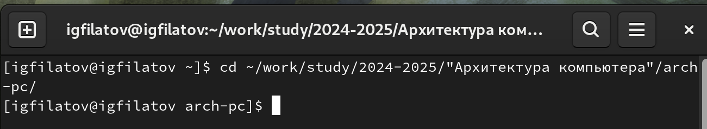{ #fig:001 width=70% }
 
Обновляю локальный репозиторий с помощью команды git pull. Убеждаюсь, что репозиторий актуален (рис. [-@fig:002]).
 
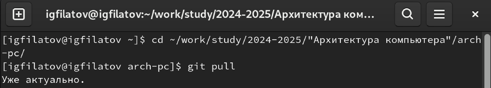{ #fig:002 width=70% }
 
Используя команду cd и относительный путь, перехожу в каталог с шаблоном отчёта по лабораторной работе № 3 (рис. [-@fig:003]).
 
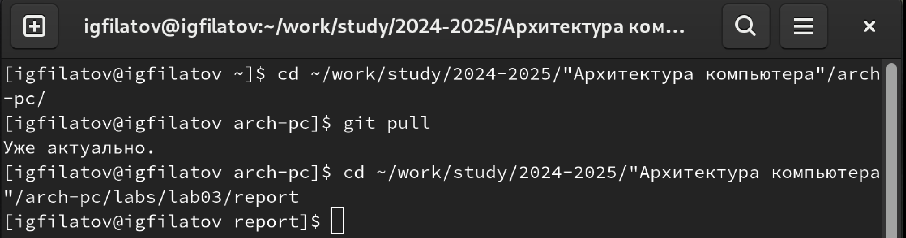{ #fig:003 width=70% }
 
Провожу компиляцию шаблона с использованием Makefile командой  make (рис. [-@fig:004]).
 
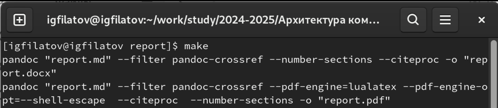{ #fig:004 width=70% }
 
Открываю файловый менеджер и проверяю, что нужные файлы сгенерировались (рис. [-@fig:005]).
 
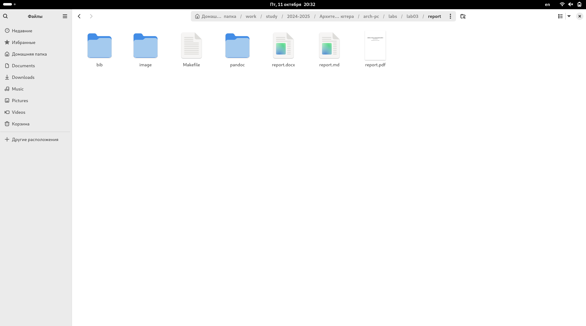{ #fig:005 width=70% }
 
Удаляю полученные файлы с использованием Makefile, используя команду make clean (рис. [-@fig:006]).
 
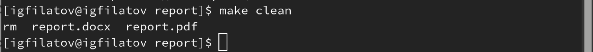{ #fig:006 width=70% }
 
Открываю файловый менеджер и проверяю, что файлы были удалены (рис. [-@fig:007]).
 
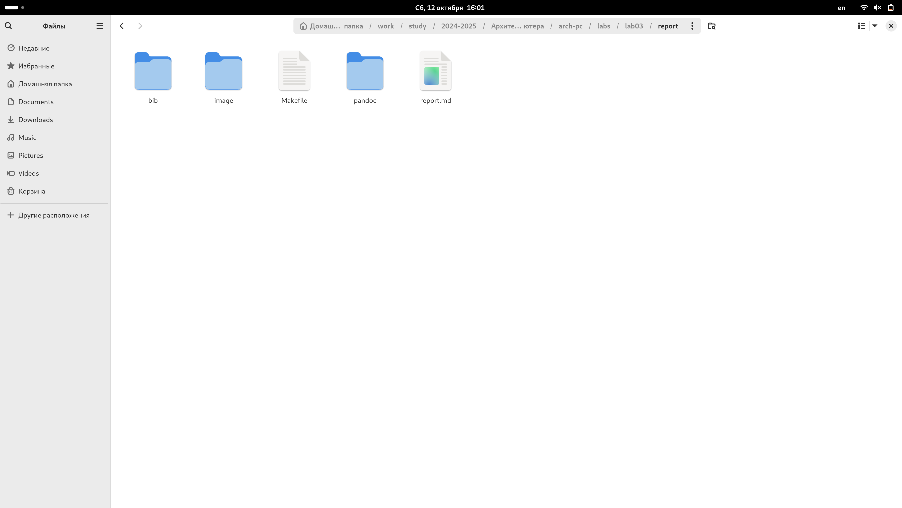{ #fig:007 width=70% }
 
Открываю файл report.md c помощью текстового редактора gedit (рис. [-@fig:008]).
 
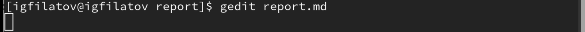{ #fig:008 width=70% }
 
Изучаю структуру этого файла (рис. [-@fig:009]).
 
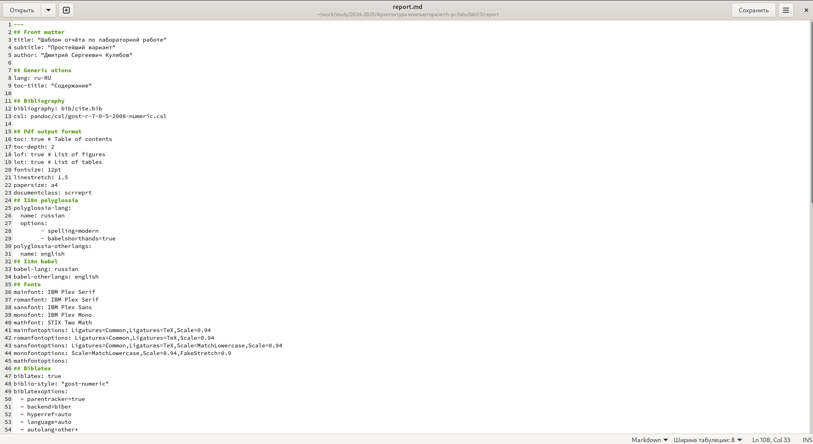{ #fig:009 width=70% }

Заполняю отчет, переименовываю его командой mv и компилирую с использованием Makefile (рис. [-@fig:010]).
 
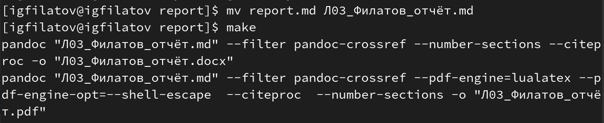{ #fig:010 width=70% }
 
Проверяю корректность полученных файлов (рис. [-@fig:011]).
 
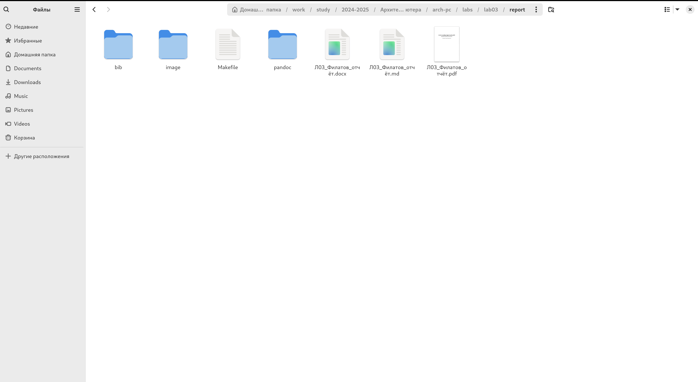{ #fig:011 width=70% }
 
Загружаю файлы на github (рис. [-@fig:012]).
 
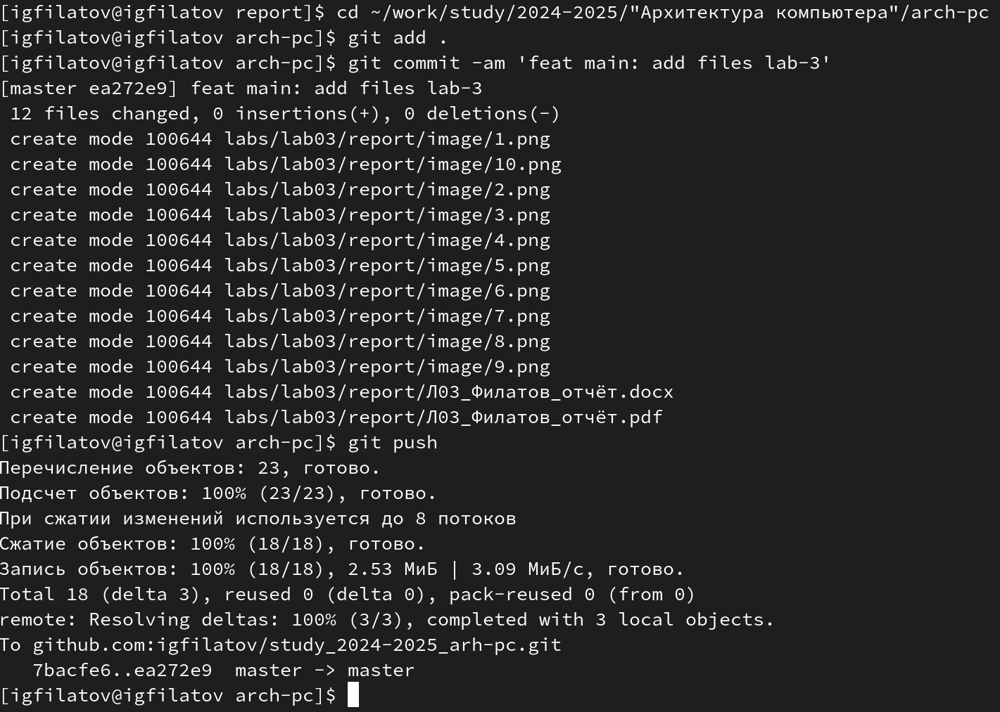{ #fig:012 width=70% }
 
## Задание для самостоятельной работы.
 
Перехожу в каталог с отчётом по лабораторной работе 2. Открываю шаблон отчёта с помощью текстового редактора gedit (рис. [-@fig:013]).
 
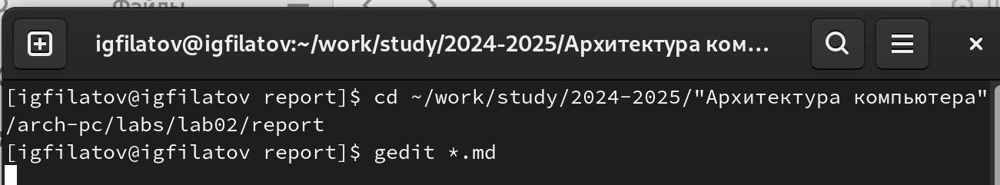{ #fig:013 width=70% }
 
Оформляю отчёт (рис. [-@fig:014]).
 
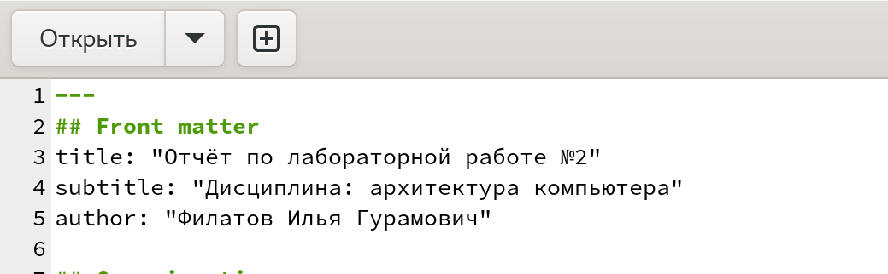{ #fig:014 width=70% }
 
Удаляю файл со старой версией отчёта командой rm. Переименовываю отчёт, с помощью команды mv, и компилирую его командой make (рис. [-@fig:015]).
 
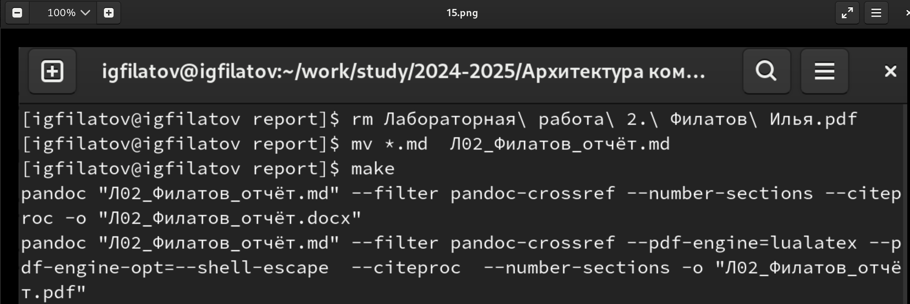{ #fig:015 width=70% }
 
Загружаю новую версию отчёта на github (рис. [-@fig:016]).
 
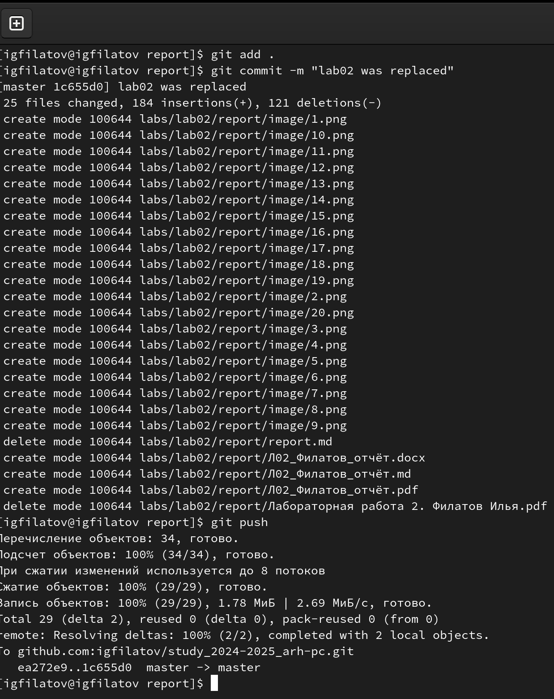{ #fig:016 width=70% }
 
# Выводы
 
Я освоил процедуру оформления отчётов с помощью легковесного языка разметки Markdown.
 
# Список литературы
 
1. [Архитектура ЭВМ](https://esystem.rudn.ru/pluginfile.php/2089530/mod_resource/…)
