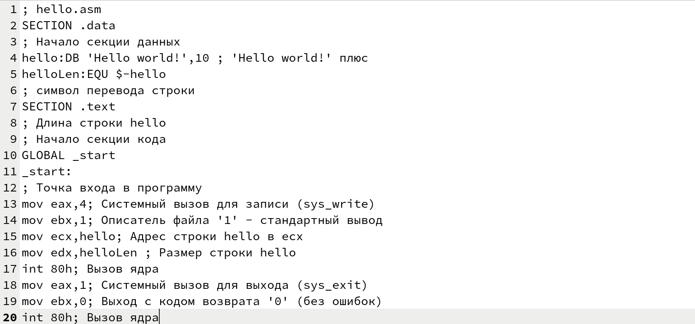

---
## Front matter
title: "Отчёт по лабораторной работе №4"
subtitle: "Дисциплина: Архитектура компьютера"
author: "Филатов Илья Гурамович"
 
## Generic otions
lang: ru-RU
toc-title: "Содержание"
 
## Bibliography
bibliography: bib/cite.bib
csl: pandoc/csl/gost-r-7-0-5-2008-numeric.csl
 
## Pdf output format
toc: true # Table of contents
toc-depth: 2
lof: true # List of figures
fontsize: 12pt
linestretch: 1.5
papersize: a4
documentclass: scrreprt
## I18n polyglossia
polyglossia-lang:
  name: russian
  options:
    - spelling=modern
    - babelshorthands=true
polyglossia-otherlangs:
  name: english
## I18n babel
babel-lang: russian
babel-otherlangs: english
## Fonts
mainfont: IBM Plex Serif
romanfont: IBM Plex Serif
sansfont: IBM Plex Sans
monofont: IBM Plex Mono
mathfont: STIX Two Math
mainfontoptions: Ligatures=Common,Ligatures=TeX,Scale=0.94
romanfontoptions: Ligatures=Common,Ligatures=TeX,Scale=0.94
sansfontoptions: Ligatures=Common,Ligatures=TeX,Scale=MatchLowercase,Scale=0.94
monofontoptions: Scale=MatchLowercase,Scale=0.94,FakeStretch=0.9
mathfontoptions:
## Biblatex
biblatex: true
biblio-style: "gost-numeric"
biblatexoptions:
  - parentracker=true
  - backend=biber
  - hyperref=auto
  - language=auto
  - autolang=other*
  - citestyle=gost-numeric
## Pandoc-crossref LaTeX customization
figureTitle: "Рис."
tableTitle: "Таблица"
listingTitle: "Листинг"
lofTitle: "Список иллюстраций"
lotTitle: "Список таблиц"
lolTitle: "Листинги"
## Misc options
indent: true
header-includes:
  - \usepackage{indentfirst}
  - \usepackage{float} # keep figures where there are in the text
  - \floatplacement{figure}{H} # keep figures where there are in the text
---
 
# Цель работы
 
Целью работы является обучение компиляции и сборке программ, написанных с помощью ассемблера NASM.
 
 
# Задание
 
1. Программа Hello world!
2. Транслятор NASM
3. Расширенный синтаксис командной строки NASM
4. Компоновщик LD
5. Запуск исполняемого файла
6. Задание для самостоятельной работы
 
# Теоретическое введение
 
Основными функциональными элементами любой электронно-вычислительной машины (ЭВМ) являются центральный процессор, память и периферийные устройства.
Взаимодействие этих устройств осуществляется через общую шину, которая  представляет собой большое количество проводников, соединяющих
устройства друг с другом. Основной задачей процессора является обработка информации, а также организация
координации всех узлов компьютера. В состав центрального процессора (ЦП) входят
следующие устройства:
 
• арифметико-логическое устройство (АЛУ) — выполняет логические и арифметические действия, необходимые для обработки информации, хранящейся в памяти.
 
• устройство управления (УУ) — обеспечивает управление и контроль всех устройств
компьютера.
 
• регистры — сверхбыстрая оперативная память небольшого объёма, входящая в состав процессора, для временного хранения промежуточных результатов выполнения
инструкций; регистры процессора делятся на два типа: регистры общего назначения и
специальные регистры.
 
Большинство команд в программах
написанных на ассемблере используют регистры в качестве операндов. Практически все
команды представляют собой преобразование данных хранящихся в регистрах процессора,
это например пересылка данных между регистрами или между регистрами и памятью, преобразование данных хранящихся в регистрах.
 
Доступ к регистрам осуществляется  по именам.
Каждый регистр процессора архитектуры x86 имеет свое название, состоящее из 2 или 3
букв латинского алфавита.
 
Названия основных регистров общего назначения:
 
• RAX, RCX, RDX, RBX, RSI, RDI — 64-битные
 
• EAX, ECX, EDX, EBX, ESI, EDI — 32-битные
 
• AX, CX, DX, BX, SI, DI — 16-битные
 
• AH, AL, CH, CL, DH, DL, BH, BL — 8-битные (половинки 16-битных регистров). Например,
AH (high AX) — старшие 8 бит регистра AX, AL (low AX) — младшие 8 бит регистра AX.
 
Оперативное запоминающее устройство (ОЗУ) — это быстродействующее энергозависимое запоминающее устройство, которое напрямую взаимодействует с узлами процессора, предназначенное для хранения программ и
данных, с которыми процессор непосредственно работает в текущий момент. ОЗУ состоит из
одинаковых пронумерованных ячеек памяти. Номер ячейки памяти — это адрес хранящихся
в ней данных.
 
В состав ЭВМ также входят периферийные устройства, которые можно разделить на:
 
• устройства внешней памяти, которые предназначены для долговременного хранения больших объёмов данных (жёсткие диски, твердотельные накопители, магнитные
ленты
 
• устройства ввода-вывода, которые обеспечивают взаимодействие ЦП с внешней
средой.
 
В основе вычислительного процесса ЭВМ лежит принцип программного управления. Программа состоит из машинных команд, которые указывают, какие операции и над какими данными, в какой последовательности
необходимо выполнить.
Набор машинных команд определяется устройством конкретного процессора. Коды команд представляют собой многоразрядные двоичные комбинации из 0 и 1. В коде машинной
команды можно выделить две части: операционную и адресную. В операционной части хранится код команды, которую необходимо выполнить. В адресной части хранятся данные
или адреса данных, которые участвуют в выполнении данной операции.
 
При выполнении каждой команды процессор выполняет определённую последовательность стандартных действий, которая называется командным циклом процессора. В
самом общем виде он заключается в следующем:
 
1. формирование адреса в памяти очередной команды.
 
2. считывание кода команды из памяти и её дешифрация.
 
3. выполнение команды.
 
4. переход к следующей команде.
 
Язык ассемблера — машинно-ориентированный
язык низкого уровня.Он больше любых других языков приближен к
архитектуре ЭВМ и её аппаратным возможностям, что позволяет получить к ним более
полный доступ, нежели в языках высокого уровня. Получить полный доступ к ресурсам компьютера в современных архитектурах нельзя,
самым низким уровнем работы прикладной программы является обращение напрямую к
ядру операционной системы. Именно на этом уровне и работают программы, написанные
на ассемблере. Таким образом язык ассемблера — это язык, с
помощью которого понятным для человека образом пишутся команды для процессора. Преобразование или трансляция команд сязыка ассемблера в исполняемый машинный код осуществляется специальной программой
транслятором — Ассемблер.
Наиболее распространёнными ассемблерами для архитектуры x86 являются:
 
• для DOS/Windows: Borland Turbo Assembler (TASM), Microsoft Macro Assembler (MASM) и
Watcom assembler (WASM);
 
• для GNU/Linux: gas (GNU Assembler), использующий AT&T-синтаксис, в отличие от
большинства других популярных ассемблеров, которые используют Intel-синтаксис.
 
NASM — это открытый проект ассемблера, версии которого доступны под различные
операционные системы и который позволяет получать объектные файлы для этих систем. В
NASM используется Intel-синтаксис и поддерживаются инструкции x86-64.
 
В процессе создания ассемблерной программы можно выделить четыре шага:
 
• Набор текста программы в текстовом редакторе и сохранение её в отдельном файле.
Каждый файл имеет свой тип (или расширение), который определяет назначение файла.
Файлы с исходным текстом программ на языке ассемблера имеют тип asm.
 
• Трансляция — преобразование с помощью транслятора, например nasm, текста программы в машинный код, называемый объектным. На данном этапе также может быть
получен листинг программы, содержащий кроме текста программы различную дополнительную информацию, созданную транслятором. Тип объектного файла — o, файла
листинга — lst.
 
• Компоновка или линковка — этап обработки объектного кода компоновщиком (ld),
который принимает на вход объектные файлы и собирает по ним исполняемый файл.
Исполняемый файл обычно не имеет расширения. Кроме того, можно получить файл
карты загрузки программы в ОЗУ, имеющий расширение map.
 
• Запуск программы. Конечной целью является работоспособный исполняемый файл.
Ошибки на предыдущих этапах могут привести к некорректной работе программы,
поэтому может присутствовать этап отладки программы при помощи специальной
программы — отладчика. При нахождении ошибки необходимо провести коррекцию
программы, начиная с первого шага.
 
# Выполнение лабораторной работы
 
## Программа Hello world!
 
Открываю терминал. Используя команду makedir и ключ -p создаю иерархическую цепочку каталогов (рис. [-@fig:001]).
 
{ #fig:001 width=70% }
 
С помощью команды cd и относительного пути перехожу в созданный каталог (рис. [-@fig:002]).
 
{ #fig:002 width=70% }
 
Командой touch создаю файл hello.asm (рис. [-@fig:003]).
 
{ #fig:003 width=70% }
 
Открываю этот файл с помощью текстового редактора gedit (рис. [-@fig:004]).
 
{ #fig:004 width=70% }
 
Ввожу последовательность команд (рис. [-@fig:005]).
 
{ #fig:005 width=70% }
 
## Транслятор NASM
 
Преобразую текст программы в объектный код с помощью команды nasm (рис. [-@fig:006]).
 
{ #fig:006 width=70% }
 
С помощью команды ls проверяю, что файл с именем hello.o был создан  (рис. [-@fig:007]).
 
{ #fig:007 width=70% }
 
## Расширенный синтаксис командной строки NASM
 
Выполняю команду, которая компилирует файл hello.asm в obj.o (опция -o задаёт имя), при этом формат выходного файла
будет elf, и в него будут включены символы для отладки (опция g). Также команда создаёт файл листинга list.lst (опция -l) (рис. [-@fig:008]).
 
{ #fig:008 width=70% }
 
Командой ls проверяю, что все файлы созданы (рис. [-@fig:009]).
 
{ #fig:009 width=70% }
 
## Компоновщик LD
 
Передаю объектный файл на обработку компоновщику командой ld для получения программы (рис. [-@fig:010]).
 
{ #fig:010 width=70% }
 
Командой ls проверяю, что исполняемый файл создан (рис. [-@fig:011]).
 
{ #fig:011 width=70% }
 
Выполняю команду, которая преобразует объектный файл с именем obj.o в исполняемый файл, которому с помощью опции -o задаётся имя main. Командой ls проверяю, что файлы созданы корректно (рис. [-@fig:012]).
 
{ #fig:012 width=70% }
 
Набрав ld --help, можно увидеть формат командной строки LD.(рис. [-@fig:013]).
 
{ #fig:013 width=70% }
 
## Запуск исполняемого файла
 
Запускаю созданный исполняемый файл (рис. [-@fig:014]).
 
{ #fig:014 width=70% }
 
## Задание для самостоятельной работы.
 
Копирую файл hello.asm командой cp, изменив его имя. (рис. [-@fig:015]).
 
{ #fig:015 width=70% }
 
С помощью редактора gedit открываю новый файл (рис. [-@fig:016]).
 
{ #fig:016 width=70% }
 
Преобразовываю текст программы его так, чтобы на экран выводились фамилия и имя (рис. [-@fig:017]).
 
{ #fig:017 width=70% }
 
Провожу трансляцию и компоновку файлов командами nasm и ld (рис. [-@fig:018]).
 
{ #fig:018 width=70% }
 
Запускаю полученный файл (рис. [-@fig:019]).
 
{ #fig:019 width=70% }
 
Командой ls проверяю, что на .asm заканчиваются  только нужные файлы. С помощью команды cp и относительного пути копирую все файлы из этого каталога, заканчивающиеся на .asm (рис. [-@fig:020]).
 
{ #fig:020 width=70% }
 
Командой cd перехожу в каталог с репозиторием. Командами git add . , git commit и git push загружаю файлы на Github (рис. [-@fig:021]).
 
{ #fig:021 width=70% }
 
# Выводы
 
Я освоил процедуру компиляции и сборки программ, написанных на ассемблере NASM.
 
# Список литературы
 
1. [Архитектура ЭВМ](https://esystem.rudn.ru/pluginfile.php/2089533/mod_resource/content/0/%D0%9B%D0%B0%D0%B1%D0%BE%D1%80%D0%B0%D1%82%D0%BE%D1%80%D0%BD%D0%B0%D1%8F%20%D1%80%D0%B0%D0%B1%D0%BE%D1%82%D0%B0%20%E2%84%964.%20%D0%A1%D0%BE%D0%B7%D0%B4%D0%B0%D0%BD%D0%B8%D0%B5%20%D0%B8%20%D0%BF%D1%80%D0%BE%D1%86%D0%B5%D1%81%D1%81%20%D0%BE%D0%B1%D1%80%D0%B0%D0%B1%D0%BE%D1%82%D0%BA%D0%B8%20%D0%BF%D1%80%D0%BE%D0%B3%D1%80%D0%B0%D0%BC%D0%BC%20%D0%BD%D0%B0%20%D1%8F%D0%B7%D1%8B%D0%BA%D0%B5%20%D0%B0%D1%81%D1%81%D0%B5%D0%BC%D0%B1%D0%BB%D0%B5%D1%80%D0%B0%20NASM.pdf)