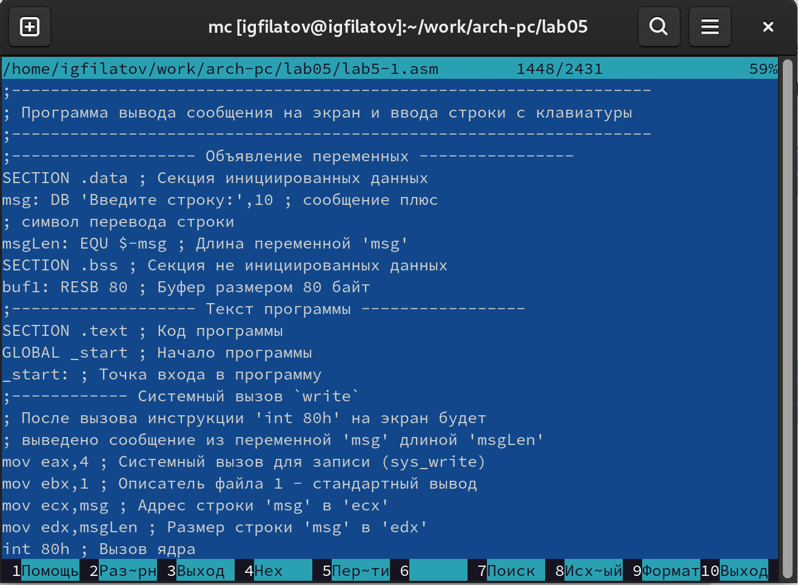
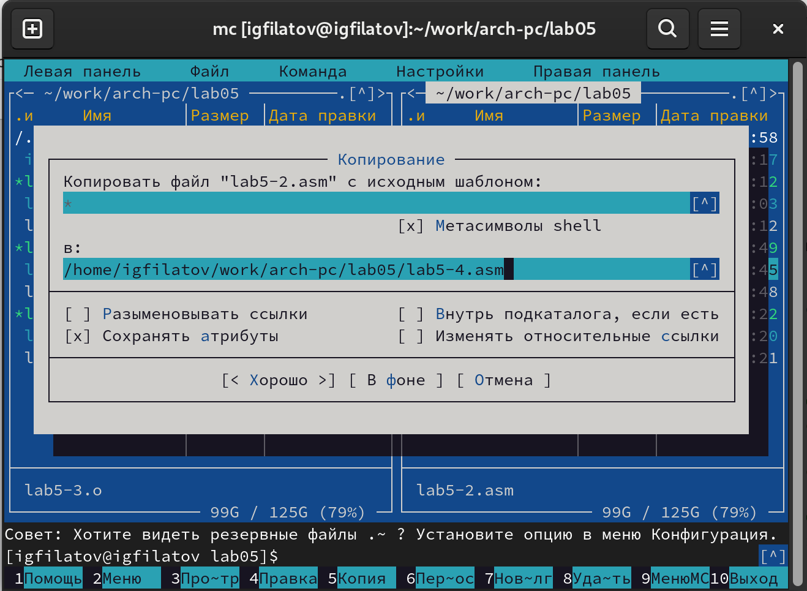

---
## Front matter
title: "Отчёт по лабораторной работе №5"
subtitle: "Дисциплина: Архитектура компьютера"
author: "Филатов Илья Гурамович"
 
## Generic otions
lang: ru-RU
toc-title: "Содержание"
 
## Bibliography
bibliography: bib/cite.bib
csl: pandoc/csl/gost-r-7-0-5-2008-numeric.csl
 
## Pdf output format
toc: true # Table of contents
toc-depth: 2
lof: true # List of figures
fontsize: 12pt
linestretch: 1.5
papersize: a4
documentclass: scrreprt
## I18n polyglossia
polyglossia-lang:
  name: russian
  options:
    - spelling=modern
    - babelshorthands=true
polyglossia-otherlangs:
  name: english
## I18n babel
babel-lang: russian
babel-otherlangs: english
## Fonts
mainfont: IBM Plex Serif
romanfont: IBM Plex Serif
sansfont: IBM Plex Sans
monofont: IBM Plex Mono
mathfont: STIX Two Math
mainfontoptions: Ligatures=Common,Ligatures=TeX,Scale=0.94
romanfontoptions: Ligatures=Common,Ligatures=TeX,Scale=0.94
sansfontoptions: Ligatures=Common,Ligatures=TeX,Scale=MatchLowercase,Scale=0.94
monofontoptions: Scale=MatchLowercase,Scale=0.94,FakeStretch=0.9
mathfontoptions:
## Biblatex
biblatex: true
biblio-style: "gost-numeric"
biblatexoptions:
  - parentracker=true
  - backend=biber
  - hyperref=auto
  - language=auto
  - autolang=other*
  - citestyle=gost-numeric
## Pandoc-crossref LaTeX customization
figureTitle: "Рис."
tableTitle: "Таблица"
listingTitle: "Листинг"
lofTitle: "Список иллюстраций"
lotTitle: "Список таблиц"
lolTitle: "Листинги"
## Misc options
indent: true
header-includes:
  - \usepackage{indentfirst}
  - \usepackage{float} # keep figures where there are in the text
  - \floatplacement{figure}{H} # keep figures where there are in the text
---
 
# Цель работы
 
Цель работы — приобрести практические навыки работы в Midnight Commander и освоить инструкции языка ассемблера mov и int.
 
 
# Задание
 
1. Работа с Midnight Commander
2. Подключение внешнего файла in_out.asm
3. Задание для самостоятельной работы
 
# Теоретическое введение
 
Midnight Commander (или просто mc) — это программа, которая позволяет просматривать структуру каталогов и выполнять основные операции по управлению файловой системой, т.е. mc является файловым менеджером. Midnight Commander позволяет сделать работу с файлами более удобной и наглядной.

Программа на языке ассемблера NASM, как правило, состоит из трёх секций: секция кода программы (SECTION .text), секция инициированных (известных во время компиляции) данных (SECTION .data) и секция неинициализированных данных (тех, под которые во время компиляции только отводится память, а значение присваивается в ходе выполнения программы) (SECTION .bss).

Инструкция языка ассемблера mov предназначена для дублирования данных источника в приёмнике. В общем виде эта инструкция записывается в виде

mov dst,src

Здесь операнд dst — приёмник, а src — источник.

В качестве операнда могут выступать регистры (register), ячейки памяти (memory) и непосредственные значения (const).

Инструкция языка ассемблера intпредназначена для вызова прерывания с указанным номером. В общем виде она записывается в виде

int n

Здесь n — номер прерывания, принадлежащий диапазону 0–255. При программировании в Linux с использованием вызовов ядра sys_calls n=80h (принято задавать в шестнадцатеричной системе счисления).

 
# Выполнение лабораторной работы
 
## Работа с Midnight Commander
 
Открываю терминал. Ввожу команду mc для открытия Midnight Commander (рис. [-@fig:001]).
 
{ #fig:001 width=70% }
 
Пользуясь клавишами ↑ , ↓ и Enter перехожу в каталог ~/work/arch-pc (рис. [-@fig:002]).
 
{ #fig:002 width=70% }
 
С помощью клавиши F7 создаю папку lab05 и перехожу в созданный каталог (рис. [-@fig:003]).
 
{ #fig:003 width=70% }
 
Пользуясь строкой ввода и командой touch создаю файл lab5-1.asm (рис. [-@fig:004]).
 
{ #fig:004 width=70% }
 
С помощью клавиши F4 открываю файл lab5-1.asm для редактирования во встроенном редакторе mcedit (рис. [-@fig:005]).
 
{ #fig:005 width=70% }
 
Ввожу текст программы и сохраняю изменения клавишей F2 (рис. [-@fig:006]).
 
{ #fig:006 width=70% }
 
С помощью клавиши F3 открываю файл lab5-1.asm для просмотра и убеждаюсь, что он содержит текст программы (рис. [-@fig:007]).
 
{ #fig:007 width=70% }
 
Сочетанием клавиш Ctrl+o скрываю панели Midnight Commander. Создаю объектный файл из программы lab5-1.asm. Выполняю компоновку и запускаю получившийся исполняемый файл. На запрос ввожу своё ФИО (рис. [-@fig:008]).
 
{ #fig:008 width=70% }

## Подключение внешнего файла in_out.asm
 
Скачиваю файл in_out.asm со страницы курса в ТУИС (рис. [-@fig:009]).
 
{ #fig:009 width=70% }
 
В одной из панелей mc открываю каталог с файлом lab5-1.asm, а в другой — каталог со скаченным файлом in_out.asm. Копирую файл in_out.asm клавишей F5 (рис. [-@fig:010]).
 
{ #fig:010 width=70% }
 
С помощью клавиши F5 создаю копию файла lab5-1.asm с именем lab5-2.asm. (рис. [-@fig:011]).
 
{ #fig:011 width=70% }

Исправляю текст программы в файле lab5-2.asm и сохраняю изменения клавишей F2 (рис. [-@fig:012]).
 
{ #fig:012 width=70% }
 
Создаю исполняемый файл и проверяю его работу, вводя на запрос своё ФИО (рис. [-@fig:013]).
 
{ #fig:013 width=70% }
 
В файле lab5-2.asm заменяю подпрограмму sprintLF на sprint и сохраняю изменения (рис. [-@fig:014]).
 
{ #fig:014 width=70% }
 
Создаю и запускаю исполняемый файл. В отличие от предыдущей версии он предлагает ввести сообщение на той же строке, на которой выводит текст, а не на следующей, из-за замены команды (рис. [-@fig:015]).
 
{ #fig:015 width=70% }

## Задание для самостоятельной работы
 
Создаю копию файла lab5-1.asm с именем lab5-3.asm (рис. [-@fig:016]).
 
{ #fig:016 width=70% }
 
Преобразовываю текст программы так, чтобы на экран выводилась введённая строка. Для этого после блока "Системный вызов `read`" добавляю команды из блока "Cистемный вызов `write`", указывая буфер для его вывода. Сохраняю изменения (рис. [-@fig:017]).
 
{ #fig:017 width=70% }

Преобразованный текст программы:

;------------------------------------------------------------------

; Программа вывода сообщения на экран и ввода строки с клавиатуры

;------------------------------------------------------------------

;------------------- Объявление переменных ----------------

SECTION .data ; Секция инициированных данных

msg: DB 'Введите строку:',10 ; сообщение плюс

; символ перевода строки

msgLen: EQU $-msg ; Длина переменной 'msg'

SECTION .bss ; Секция не инициированных данных

buf1: RESB 80 ; Буфер размером 80 байт

;------------------- Текст программы -----------------

SECTION .text ; Код программы

GLOBAL _start ; Начало программы

_start: ; Точка входа в программу

;------------ Cистемный вызов `write`

; После вызова инструкции 'int 80h' на экран будет

; выведено сообщение из переменной 'msg' длиной 'msgLen'

mov eax,4 ; Системный вызов для записи (sys_write)

mov ebx,1 ; Описатель файла 1 - стандартный вывод

mov ecx,msg ; Адрес строки 'msg' в 'ecx'

mov edx,msgLen ; Размер строки 'msg' в 'edx'

int 80h ; Вызов ядра

;------------ системный вызов `read` ----------------------

; После вызова инструкции 'int 80h' программа будет ожидать ввода

; строки, которая будет записана в переменную 'buf1' размером 80 байт

mov eax, 3 ; Системный вызов для чтения (sys_read)

mov ebx, 0 ; Дескриптор файла 0 - стандартный ввод

mov ecx, buf1 ; Адрес буфера под вводимую строку

mov edx, 80 ; Длина вводимой строки

int 80h ; Вызов ядра

;------------

mov eax,4 ; Системный вызов для записи (sys_write)

mov ebx,1 ; Описатель файла 1 - стандартный вывод

mov ecx,buf1 ; Адрес строки 'buf1' в 'ecx'

mov edx,buf1 ; Размер строки 'buf1' в 'edx'

int 80h ; Вызов ядра

;------------ Системный вызов `exit` ----------------------

; После вызова инструкции 'int 80h' программа завершит работу

mov eax,1 ; Системный вызов для выхода (sys_exit)

mov ebx,0 ; Выход с кодом возврата 0 (без ошибок)

int 80h ; Вызов ядра
 
Создаю исполняемый файл и проверяю его работу (рис. [-@fig:018]).
 
{ #fig:018 width=70% }
 
Создаю копию файла lab5-2.asm с именем lab5-4.asm (рис. [-@fig:019]).
 
{ #fig:019 width=70% }
 
Преобразовываю текст программы так, чтобы на экран выводилась введённая строка. Для этого использую подпрограмму sprintLF из in_out.asm для печати сообщения. Указываю буфер для его вывода и сохраняю файл (рис. [-@fig:020]).
 
{ #fig:020 width=70% }

Преобразованный текст программы:

;--------------------------------------------------------------------

; Программа вывода сообщения на экран и ввода строки с клавиатуры

;---------------------------------------------------------------------

%include 'in_out.asm' ; подключение внешнего файла

SECTION .data ; Секция инициированных данных

msg: DB 'Введите строку: ',0h ; сообщение

SECTION .bss ; Секция не инициированных данных

buf1: RESB 80 ; Буфер размером 80 байт

SECTION .text ; Код программы

GLOBAL _start ; Начало программы

_start: ; Точка входа в программу

mov eax, msg ; запись адреса выводимого сообщения в `EAX`

call sprint ; вызов подпрограммы печати сообщения

mov ecx, buf1 ; запись адреса переменной в `EAX`

mov edx, 80 ; запись длины вводимого сообщения в `EBX`

call sread ; вызов подпрограммы ввода сообщения

mov eax, buf1 ; запись адреса выводимого сообщения в `EAX`

call sprintLF ; вызов подпрограммы печати сообщения

call quit ; вызов подпрограммы завершения
 
Создаю исполняемый файл и проверяю его работу (рис. [-@fig:021]).
 
{ #fig:021 width=70% }
 
# Выводы
 
Я получил практические навыки работы в Midnight Commander и  освоил инструкции
языка ассемблера mov и int.
 
# Список литературы
 
1. [Архитектура ЭВМ](https://esystem.rudn.ru/pluginfile.php/2089538/mod_resource/content/0/%D0%9B%D0%B0%D0%B1%D0%BE%D1%80%D0%B0%D1%82%D0%BE%D1%80%D0%BD%D0%B0%D1%8F%20%D1%80%D0%B0%D0%B1%D0%BE%D1%82%D0%B0%20%E2%84%965.%20%D0%9E%D1%81%D0%BD%D0%BE%D0%B2%D1%8B%20%D1%80%D0%B0%D0%B1%D0%BE%D1%82%D1%8B%20%D1%81%20Midnight%20Commander%20%28%29.%20%D0%A1%D1%82%D1%80%D1%83%D0%BA%D1%82%D1%83%D1%80%D0%B0%20%D0%BF%D1%80%D0%BE%D0%B3%D1%80%D0%B0%D0%BC%D0%BC%D1%8B%20%D0%BD%D0%B0%20%D1%8F%D0%B7%D1%8B%D0%BA%D0%B5%20%D0%B0%D1%81%D1%81%D0%B5%D0%BC%D0%B1%D0%BB%D0%B5%D1%80%D0%B0%20NASM.%20%D0%A1%D0%B8%D1%81%D1%82%D0%B5%D0%BC%D0%BD%D1%8B%D0%B5%20%D0%B2%D1%8B%D0%B7%D0%BE%D0%B2%D1%8B%20%D0%B2%20%D0%9E%D0%A1%20GNU%20Linux.pdf)