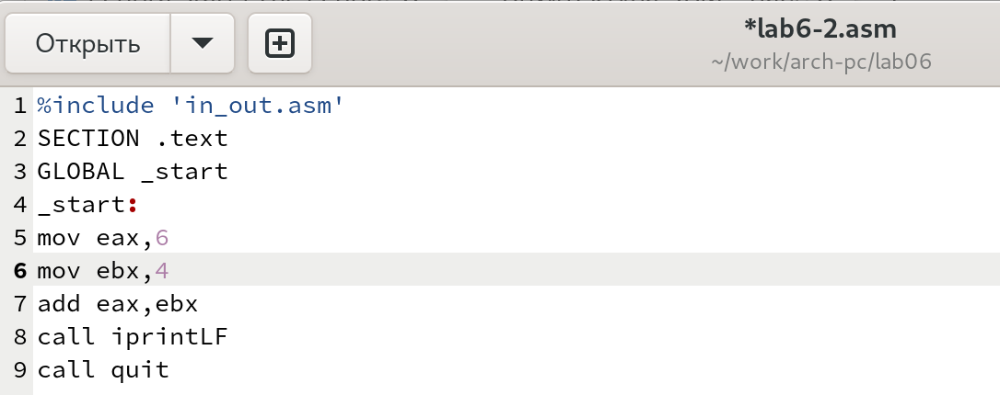

---
## Front matter
title: "Отчёт по лабораторной работе №6"
subtitle: "Дисциплина: Архитектура компьютера"
author: "Филатов Илья Гурамович"
 
## Generic otions
lang: ru-RU
toc-title: "Содержание"
 
## Bibliography
bibliography: bib/cite.bib
csl: pandoc/csl/gost-r-7-0-5-2008-numeric.csl
 
## Pdf output format
toc: true # Table of contents
toc-depth: 2
lof: true # List of figures
fontsize: 12pt
linestretch: 1.5
papersize: a4
documentclass: scrreprt
## I18n polyglossia
polyglossia-lang:
  name: russian
  options:
    - spelling=modern
    - babelshorthands=true
polyglossia-otherlangs:
  name: english
## I18n babel
babel-lang: russian
babel-otherlangs: english
## Fonts
mainfont: IBM Plex Serif
romanfont: IBM Plex Serif
sansfont: IBM Plex Sans
monofont: IBM Plex Mono
mathfont: STIX Two Math
mainfontoptions: Ligatures=Common,Ligatures=TeX,Scale=0.94
romanfontoptions: Ligatures=Common,Ligatures=TeX,Scale=0.94
sansfontoptions: Ligatures=Common,Ligatures=TeX,Scale=MatchLowercase,Scale=0.94
monofontoptions: Scale=MatchLowercase,Scale=0.94,FakeStretch=0.9
mathfontoptions:
## Biblatex
biblatex: true
biblio-style: "gost-numeric"
biblatexoptions:
  - parentracker=true
  - backend=biber
  - hyperref=auto
  - language=auto
  - autolang=other*
  - citestyle=gost-numeric
## Pandoc-crossref LaTeX customization
figureTitle: "Рис."
tableTitle: "Таблица"
listingTitle: "Листинг"
lofTitle: "Список иллюстраций"
lotTitle: "Список таблиц"
lolTitle: "Листинги"
## Misc options
indent: true
header-includes:
  - \usepackage{indentfirst}
  - \usepackage{float} # keep figures where there are in the text
  - \floatplacement{figure}{H} # keep figures where there are in the text
---
 
# Цель работы
 
Освоить арифметические инструкции языка ассемблера NASM.
 
 
# Задание
 
1. Символьные и численные данные в NASM
2. Выполнение арифметических операций в NASM
3. Задание для самостоятельной работы
 
# Теоретическое введение
 
Большинство инструкций на языке ассемблера требуют обработки операндов. Адрес операнда предоставляет место, где хранятся данные, подлежащие обработке. Это могут быть данные хранящиеся в регистре или в ячейке памяти.

Существует три основных способа адресации:

• Регистровая адресация – операнды хранятся в регистрах и в команде используются имена этих регистров.

• Непосредственная адресация – значение операнда задается непосредственно в команде.

• Адресация памяти – операнд задает адрес в памяти. В команде указывается символическое обозначение ячейки памяти, над содержимым которой требуется выполнить
операцию.

Схема команды целочисленного сложения add выполняет сложение двух операндов и записывает результат по адресу первого операнда.

Арифметические операции в NASM:

Команда целочисленного вычитания sub работает аналогично команде add.

Существуют специальные команды: inc и dec, которые увеличивают и уменьшают на 1 свой операнд.

Команда neg рассматривает свой операнд как число со знаком и меняет знак операнда на противоположный. Операндом может быть регистр или ячейка памяти любого размера.

Для беззнакового умножения используется команда mul, а для знакового умножения – команда imul. Для команд умножения один из сомножителей указывается в команде и должен находиться в регистре или в памяти, но не может быть непосредственным операндом. Второй сомножитель в команде явно не указывается и должен находиться в регистре EAX,AX или AL, а результат помещается в регистры EDX:EAX, DX:AX или AX, в зависимости от размера операнда.

Для деления, как и для умножения, существует 2 команды div (от англ. divide - деление) и idiv. В командах деления указывается только один операнд – делитель, который может быть регистром или ячейкой памяти, но не может быть непосредственным операндом. Местоположение делимого и результата для команд деления зависит от размера делителя. Кроме того, так как в результате деления получается два числа – частное и остаток, то эти числа помещаются в определённые регистры.

Ввод информации с клавиатуры и вывод её на экран осуществляется в символьном виде. Кодирование этой информации производится согласно кодовой таблице символов ASCII.

Среди инструкций NASM нет такой, которая выводит числа (не в символьном виде). Поэтому, например, чтобы вывести число, надо предварительно преобразовать его цифры в ASCII-коды этих цифр и выводить на экран эти коды, а не само число. Если же выводить число на экран непосредственно, то экран воспримет его не как число, а как последовательность ASCII-символов – каждый байт числа будет воспринят как один ASCII-символ – и выведет на экран эти символы

Для решения этой проблемы необходимо проводить преобразование ASCII символов в числа и обратно.

Для выполнения лабораторных работ в файле in_out.asm реализованы подпрограммы для преобразования ASCII символов в числа и обратно. Это:

• iprint – вывод на экран чисел в формате ASCII, перед вызовом iprint в регистр eax
необходимо записать выводимое число (mov eax,<int>).

• iprintLF – работает аналогично iprint, но при выводе на экран после числа добавляет
к символ перевода строки.

• atoi – функция преобразует ascii-код символа в целое число и записает результат
в регистр eax, перед вызовом atoi в регистр eax необходимо записать число (mov
eax,<int>).

# Выполнение лабораторной работы
 
## Символьные и численные данные в NASM
 
Открываю терминал. Используя команду makedir создаю каталог для лабораторной работы. Перехожу в него и командой touch создаю файл lab6-1.asm (рис. [-@fig:001]).
 
{ #fig:001 width=70% }
 
Открываю файл с помощью редактора gedit и ввожу текст программы из листинга 6.1 (рис. [-@fig:002]).
 
{ #fig:002 width=70% }
 
Чтобы программа, которая содержит подпрограммы из in_out.asm, работала корректно, командой cp копирую этот файл из каталога lab05 в каталог lab06 (рис. [-@fig:003]).
 
{ #fig:003 width=70% }
 
Создаю исполняемый файл и запускаю его. Так как программа воспринимает 6 и 4 как символы (из-за записи в одинарных кавычках), то суммирует их коды и сопоставляет получившемуся коду символ из кодовой таблицы ASCII, в данном случае это "j" (рис. [-@fig:004]).
 
{ #fig:004 width=70% }
 
Открываю файл и убираю одинарные кавычки (рис. [-@fig:005]).
 
{ #fig:005 width=70% }
 
Создаю исполняемый файл и запускаю его. В отличие от предыдущего примера программа воспринимает 6 и 4 как коды, суммирует их и выводит символ с кодом их суммы - по таблице коду 10 соответствует символ перевода строки, который не отображается на экране (рис. [-@fig:006]).
 
{ #fig:006 width=70% }
 
Создаю файл lab6-2.asm и открываю его с помощью редактора gedit (рис. [-@fig:007]).
 
{ #fig:007 width=70% }
 
Ввожу текст программы из листинга 6.2 (рис. [-@fig:008]).
 
{ #fig:008 width=70% }
 
Создаю и запускаю исполняемый файл, который складывает коды символов 6 и 4 и, в отличие от программы из листинга 6.1, выводит число, а не символ, кодом которого
является это число (рис. [-@fig:009]).
 
{ #fig:009 width=70% }
 
Открываю файл и убираю одинарные кавычки, аналагично предыдущей программе (рис. [-@fig:010]).
 
{ #fig:010 width=70% }
 
Создаю и запускаю исполняемый файл. В отличие от предыдущего примера программа складывет числа, а не коды символов, в результате мы получим число 10 (рис. [-@fig:011]).
 
{ #fig:011 width=70% }
 
Открываю файл и с помощью программы gedit и меняю функцию iprintLF на iprint (рис. [-@fig:012]).
 
{ #fig:012 width=70% }
 
Создаю и запускаю исполняемый файл. В отличие от предыдущего он не выводит с результатом символ переноса строки, из-за чего следующую команду можно написать на той же строке, на которой выводился ответ  (рис. [-@fig:013]).
 
{ #fig:013 width=70% }

## Выполнение арифметических операций в NASM
 
Создаю файл lab6-3.asm и открываю его с помощью редактора gedit (рис. [-@fig:014]).
 
{ #fig:014 width=70% }

Ввожу текст из листинга 6.3 (рис. [-@fig:015]).
 
{ #fig:015 width=70% }
 
Создаю и запускаю исполняемый файл, который выводит значение выражения  (5*2+3)/3 (рис. [-@fig:016]).
 
{ #fig:016 width=70% }
 
Открываю файл и меняю его так, чтобы он выводил значение выражения (4*6+2)/5 (рис. [-@fig:017]).
 
{ #fig:017 width=70% }

Текст программы:

;--------------------------------

; Программа вычисления выражения

;--------------------------------

%include 'in_out.asm' ; подключение внешнего файла

SECTION .data

div: DB 'Результат: ',0

rem: DB 'Остаток от деления: ',0

SECTION .text

GLOBAL _start

_start:

; ---- Вычисление выражения

mov eax,4 ; EAX=4

mov ebx,6 ; EBX=6

mul ebx ; EAX=EAX*EBX

add eax,2 ; EAX=EAX+2

xor edx,edx ; обнуляем EDX для корректной работы div

mov ebx,5 ; EBX=5

div ebx ; EAX=EAX/5, EDX=остаток от деления

mov edi,eax ; запись результата вычисления в 'edi'

; ---- Вывод результата на экран

mov eax,div ; вызов подпрограммы печати

call sprint ; сообщения 'Результат: '

mov eax,edi ; вызов подпрограммы печати значения

call iprintLF ; из 'edi' в виде символов

mov eax,rem ; вызов подпрограммы печати

call sprint ; сообщения 'Остаток от деления: '

mov eax,edx ; вызов подпрограммы печати значения

call iprintLF ; из 'edx' (остаток) в виде символов

call quit ; вызов подпрограммы завершения

Создаю и запускаю исполняемый файл, который выводит значение 5 с остатком 1, значит вычисления верны (рис. [-@fig:018]).
 
{ #fig:018 width=70% }

Создаю файл variant.asm и открываю его с помощью редактора gedit (рис. [-@fig:019]).
 
{ #fig:019 width=70% }
 
Ввожу текст из листинга 6.4 (рис. [-@fig:020]).
 
{ #fig:020 width=70% }
 
Создаю и запускаю исполняемый файл. Ввожу номер своего студенческого билета – 1132246766. Так как число 1132246760 делится на 20, то остаток от деления – 6. Программа прибавляет к этому числу 1 и выводит верный результат – 7 (рис. [-@fig:021]).
 
{ #fig:021 width=70% }

Ответы на вопросы:

1. За вывод сообщения "Ваш вариант" овечают нижеприведённые строки:

mov eax,rem

call sprint

2. 

mov ecx, x

mov edx, 80

call sread

Первая инструкция используется чтобы сохранить адрес вводимой сроки в регистр ecx. Вторая – чтобы сохранить число 80 в регистр edx. Третья – для вывова подпрограммы из файла in_out.asm, которая позволяет ввести сообщение.

3. Инструкция call atoi вызывает подпрограмму из файла in_out.asm, которая преобразует ascii-код символа в целое число.

4. За вычисление варианта отвечают эти инструкции:

xor edx,edx

mov ebx,20

div ebx

inc edx

5. При выполнении инструкции “div ebx” остаток от деления записывается в регистр ebx.

6. Инструкция “inc edx” увеличивает значение, находящееся в регистре edx на 1

7. За вывод на экран результата вычислений отвечают сторки:

mov eax,edx

call iprintLF

## Задание для самостоятельной работы

Создаю файл work7.asm и открываю его с помощью редактора gedit (рис. [-@fig:022]).
 
{ #fig:022 width=70% }

Пишу программу которая вычисляет значение функции из варианта 7 (рис. [-@fig:023]).
 
{ #fig:023 width=70% }

Текст программы:

%include 'in_out.asm'

SECTION .data

msg: DB 'Введите x: ',0

rem: DB 'Результат: ',0

SECTION .bss

x: RESB 80

SECTION .text

GLOBAL _start

_start:

mov eax, msg

call sprintLF

mov ecx, x

mov edx, 80

call sread

mov eax,x ; eax=x

call atoi ; ASCII кода в число, `eax=x`

add eax,-1 ; eax=eax-1=x-1

mov ebx,eax ; ebx=eax=x-1

mul ebx ; eax=eax*ebx=(x-1)*(x-1)

mov ebx,5 ; ebx=5

mul ebx ; eax=eax*ebx=5*(x-1)(x-1)

mov edi,eax ;edi=eax=5*(x-1)(x-1)

mov eax,rem

call sprint

mov eax,edi

call iprintLF

call quit

Создаю и запускаю исполняемый файл. Проверяю программу на предложенных значенях аргумента – 3 и 5. В обоих случаях программа выводит верный результат (рис. [-@fig:024]).
 
{ #fig:024 width=70% }

# Выводы
 
Я освоил арифметические инструкции языка ассемблера NASM.
 
# Список литературы
 
1. [Архитектура ЭВМ](https://esystem.rudn.ru/pluginfile.php/2089542/mod_resource/content/0/%D0%9B%D0%B0%D0%B1%D0%BE%D1%80%D0%B0%D1%82%D0%BE%D1%80%D0%BD%D0%B0%D1%8F%20%D1%80%D0%B0%D0%B1%D0%BE%D1%82%D0%B0%20%E2%84%966.%20%D0%90%D1%80%D0%B8%D1%84%D0%BC%D0%B5%D1%82%D0%B8%D1%87%D0%B5%D1%81%D0%BA%D0%B8%D0%B5%20%D0%BE%D0%BF%D0%B5%D1%80%D0%B0%D1%86%D0%B8%D0%B8%20%D0%B2%20NASM..pdf)