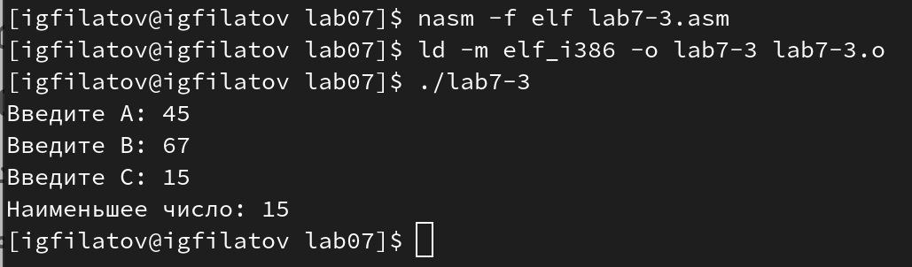

---
## Front matter
title: "Отчёт по лабораторной работе №7"
subtitle: "Дисциплина: Архитектура компьютера"
author: "Филатов Илья Гурамович"
 
## Generic otions
lang: ru-RU
toc-title: "Содержание"
 
## Bibliography
bibliography: bib/cite.bib
csl: pandoc/csl/gost-r-7-0-5-2008-numeric.csl
 
## Pdf output format
toc: true # Table of contents
toc-depth: 2
lof: true # List of figures
fontsize: 12pt
linestretch: 1.5
papersize: a4
documentclass: scrreprt
## I18n polyglossia
polyglossia-lang:
  name: russian
  options:
    - spelling=modern
    - babelshorthands=true
polyglossia-otherlangs:
  name: english
## I18n babel
babel-lang: russian
babel-otherlangs: english
## Fonts
mainfont: IBM Plex Serif
romanfont: IBM Plex Serif
sansfont: IBM Plex Sans
monofont: IBM Plex Mono
mathfont: STIX Two Math
mainfontoptions: Ligatures=Common,Ligatures=TeX,Scale=0.94
romanfontoptions: Ligatures=Common,Ligatures=TeX,Scale=0.94
sansfontoptions: Ligatures=Common,Ligatures=TeX,Scale=MatchLowercase,Scale=0.94
monofontoptions: Scale=MatchLowercase,Scale=0.94,FakeStretch=0.9
mathfontoptions:
## Biblatex
biblatex: true
biblio-style: "gost-numeric"
biblatexoptions:
  - parentracker=true
  - backend=biber
  - hyperref=auto
  - language=auto
  - autolang=other*
  - citestyle=gost-numeric
## Pandoc-crossref LaTeX customization
figureTitle: "Рис."
tableTitle: "Таблица"
listingTitle: "Листинг"
lofTitle: "Список иллюстраций"
lotTitle: "Список таблиц"
lolTitle: "Листинги"
## Misc options
indent: true
header-includes:
  - \usepackage{indentfirst}
  - \usepackage{float} # keep figures where there are in the text
  - \floatplacement{figure}{H} # keep figures where there are in the text
---
 
# Цель работы
 
Изучить команды условного и безусловного переходов, приобрести навыки написания
программ с использованием переходов, ознакомиться с назначением и структурой файла
листинга.
 
 
# Задание
 
1. Реализация переходов в NASM
2. Изучение структуры файлы листинга
3. Задание для самостоятельной работы
 
# Теоретическое введение
 
Для реализации ветвлений в ассемблере используются так называемые команды передачи
управления или команды перехода. Можно выделить 2 типа переходов:

• условный переход – выполнение или не выполнение перехода в определенную точку
программы в зависимости от проверки условия.

• безусловный переход – выполнение передачи управления в определенную точку программы без каких-либо условий.

Безусловный переход выполняется инструкцией jmp (от англ. jump – прыжок), которая
включает в себя адрес перехода, куда следует передать управление.

Адрес перехода может быть либо меткой, либо адресом области памяти, в которую предварительно помещен указатель перехода. Кроме того, в качестве операнда можно использовать
имя регистра, в таком случае переход будет осуществляться по адресу, хранящемуся в этом
регистре.

Флаг – это бит, принимающий значение 1 («флаг установлен»), если выполнено некоторое
условие, и значение 0 («флаг сброшен») в противном случае. Флаги работают независимо
друг от друга, и лишь для удобства они помещены в единый регистр — регистр флагов, отражающий текущее состояние процессора. В следующей таблице указано положение битовых
флагов в регистре флагов.

Флаги состояния (биты 0, 2, 4, 6, 7 и 11) отражают результат выполнения арифметических
инструкций, таких как ADD, SUB, MUL, DIV.

Инструкция cmp является одной из инструкций, которая позволяет сравнить операнды и
выставляет флаги в зависимости от результата сравнения.

Инструкция cmp является командой сравнения двух операндов и имеет такой же формат,
как и команда вычитания.

Команда cmp, так же как и команда вычитания, выполняет вычитание, но результат вычитания никуда не записывается и единственным результатом
команды сравнения является формирование флагов.

Команда условного перехода имеет вид

j(мнемоника перехода) label

Мнемоника перехода связана со значением анализируемых флагов или со способом формирования этих флагов.
В табл. 7.3. представлены команды условного перехода, которые обычно ставятся после
команды сравнения cmp. В их мнемокодах указывается тот результат сравнения, при котором
надо делать переход.

Листинг (в рамках понятийного аппарата NASM) — это один из выходных файлов, создаваемых транслятором. Он имеет текстовый вид и нужен при отладке программы, так как
кроме строк самой программы он содержит дополнительную информацию.

Все ошибки и предупреждения, обнаруженные при ассемблировании, транслятор выводит
на экран, и файл листинга не создаётся.

Структура листинга:

• номер строки — это номер строки файла листинга.

• адрес — это смещение машинного кода от начала текущего сегмента.

• машинный код представляет собой ассемблированную исходную строку в виде шестнадцатеричной последовательности инструкция.

• исходный текст программы — это строка исходной программы вместе с комментариями.

# Выполнение лабораторной работы
 
## Реализация переходов в NASM
 
Открываю терминал. Создаю каталог для работы lab07 и перехожу в него. Создаю в нём файл lab7-1.asm (рис. [-@fig:001]).
 
{ #fig:001 width=70% }
 
Открываю файл с помощью редактора gedit и ввожу текст программы из листинга 7.1 (рис. [-@fig:002]).
 
{ #fig:002 width=70% }
 
Чтобы программа, которая содержит подпрограммы из in_out.asm, работала корректно, копирую этот файл из каталога lab06 в каталог lab07 (рис. [-@fig:003]).
 
{ #fig:003 width=70% }
 
Создаю исполняемый файл и запускаю его (рис. [-@fig:004]).
 
{ #fig:004 width=70% }
 
Меняю текст программы в соответствии с листингом 7.2. Программа начинает с метки _label2, потом переходит к метке _label1, а потом сразу к концу программы, пропуская _label3 (рис. [-@fig:005]).
 
{ #fig:005 width=70% }
 
Создаю исполняемый файл и запускаю его (рис. [-@fig:006]).
 
{ #fig:006 width=70% }
 
Меняю текст программы в соответствии с заданием. От начала программы перехожу к метке _label3, от неё — к _label2, от _label2 — к _label1, а от _label1 — к концу (рис. [-@fig:007]).
 
{ #fig:007 width=70% }
 
Создаю исполняемый файл и проверяю его работу (рис. [-@fig:008]).
 
{ #fig:008 width=70% }

Создаю файл lab7-2.asm в каталоге ~/work/arch-pc/lab07 и открываю его с помощью редактора gedit (рис. [-@fig:009]).
 
{ #fig:009 width=70% }
 
Изучаю текст программы из листинга 7.3 и ввожу его в lab7-2.asm (рис. [-@fig:010]).
 
{ #fig:010 width=70% }
 
Создаю и запускаю исполняемый файл. Проверяю его работу, вводя разные значения переменной B (рис. [-@fig:011]).
 
{ #fig:011 width=70% }

## Изучение структуры файлы листинга
 
Создаю файл листинга для программы из файла lab7-2.asm и открываю его с помощью редактора gedit (рис. [-@fig:012]).
 
{ #fig:012 width=70% }
 
Выбираю три строки из файла листинга. Первый столбец — номера строк (32, 33 и 34), второй — смещение машинного кода от начала текущего сегмента в виде шестнадцатеричной последовательности, третий — машинный код, в который ассемблируется инструкция, последние два — исходный текст программы (рис. [-@fig:013]).
 
{ #fig:013 width=70% }
 
Открываю файл с программой lab7-2.asm и в строке с инструкцией mov убераю второй операнд (рис. [-@fig:014]).
 
{ #fig:014 width=70% }

Создаю файл листинга. Терминал предупреждает об ошибке. Открываю файл в редакторе gedit (рис. [-@fig:015]).
 
{ #fig:015 width=70% }
 
Файл листинга не создался, вместо него — текст программы, к которому добавился текст той же ошибки, что вывел терминал (рис. [-@fig:016]).
 
{ #fig:016 width=70% }

## Задание для самостоятельной работы

Создаю файл lab7-3.asm, открываю его и пишу программу нахождения наименьшей из 3 целочисленных переменных (рис. [-@fig:017]).
 
{ #fig:017 width=70% }

Текст программы:

%include 'in_out.asm'

section .data

msg1 db 'Введите A: ',0h

msg2 db 'Введите B: ',0h

msg3 db 'Введите C: ',0h

msg4 db "Наименьшее число: ",0h

section .bss

min resb 10

A resb 10

B resb 10

C resb 10

section .text

global _start

_start:

; ---------- Вывод сообщения 'Введите A: '

mov eax,msg1

call sprint

; ---------- Ввод 'A'

mov ecx,A

mov edx,10

call sread

; ---------- Вывод сообщения 'Введите B: '

mov eax,msg2

call sprint

; ---------- Ввод 'B'

mov ecx,B

mov edx,10

call sread

; ---------- Преобразование 'B' из символа в число

mov eax,B

call atoi ; Вызов подпрограммы перевода символа в число

mov [B],eax ; запись преобразованного числа в 'B'

; ---------- Вывод сообщения 'Введите C: '

mov eax,msg3

call sprint

; ---------- Ввод 'C'

mov ecx,C

mov edx,10

call sread

; ---------- Записываем 'A' в переменную 'min'

mov ecx,[A] ; 'ecx = A'

mov [min],ecx ; 'min = A'

; ---------- Сравниваем 'A' и 'С' (как символы)

cmp ecx,[C] ; Сравниваем 'C' и 'A'

jl check_B ; если 'A<C', то переход на метку 'check_B',

mov ecx,[C] ; иначе 'ecx = C'

mov [min],ecx ; 'min = C'

; ---------- Преобразование 'min(A,C)' из символа в число

check_B:

mov eax,min

call atoi ; Вызов подпрограммы перевода символа в число

mov [min],eax ; запись преобразованного числа в `min`

; ---------- Сравниваем 'min(A,C)' и 'B' (как числа)

mov ecx,[min]

cmp ecx,[B] ; Сравниваем 'min(A,C)' и 'B'

jl fin ; если 'min(A,C)<B', то переход на 'fin',

mov ecx,[B] ; иначе 'ecx = B'

mov [min],ecx

; ---------- Вывод результата

fin:

mov eax, msg4

call sprint ; Вывод сообщения 'Наименьшее число:'

mov eax,[min]

call iprintLF ; Вывод 'min(A,B,C)'

call quit ; Выход

Создаю и запускаю исполняемый файл, работу которого проверяю значениями из 7-ого варианта (рис. [-@fig:018]).
 
{ #fig:018 width=70% }

Создаю файл lab7-4.asm, открываю его и пишу программу которая для введенных с клавиатуры значений вычисляет значение функции из варианта 7 (рис. [-@fig:019]).
 
{ #fig:019 width=70% }

Текст программы:

%include 'in_out.asm'

section .data

msg1 db 'Введите x: ',0h

msg2 db 'Введите a: ',0h

msg3 db "Значение: ",0h

section .bss

x resb 10

a resb 10

answer resb 10

section .text

global _start

_start:

; ---------- Вывод сообщения 'Введите x: '

mov eax,msg1

call sprint

; ---------- Ввод 'x'

mov ecx,x

mov edx,10

call sread

; ---------- Преобразование 'x' из символа в число

mov eax,x

call atoi ; Вызов подпрограммы перевода символа в число

mov [x],eax ; запись преобразованного числа в 'x'

; ---------- Вывод сообщения 'Введите a: '

mov eax,msg2

call sprint

; ---------- Ввод 'a'

mov ecx,a

mov edx,10

call sread

; ---------- Преобразование 'a' из символа в число

mov eax,a

call atoi ; Вызов подпрограммы перевода символа в число

mov [a],eax ; запись преобразованного числа в 'a'

; ---------- Записываем 'x' в регистр 'ecx'

mov ecx,[x] ; 'ecx = A'

; ---------- Сравниваем 'x' и 'a' (как числа)

cmp ecx,[a] ; Сравниваем 'x' и 'a'

je next ; если 'x=a', то переход на метку 'next',

mov eax,[a] ; иначе 'eax = a'

mov ebx,[x] ; 'ebx = x'

add eax,ebx ; 'eax=eax+ebx=a+x'

jp fin ; 'Переход к концу программы'

; ---------- Если 'x=a', то

next:

mov eax,6 ; иначе 'eax = 6'

mov ebx,[a] ; 'ebx = a'

mul ebx ; 'eax=eax*ebx=6a'

; ---------- Вывод результата

fin:

mov [answer],eax

mov eax, msg3

call sprint ; Вывод сообщения 'Наименьшее число: '

mov eax,[answer]

call iprintLF ; Вывод 'min(A,B,C)'

call quit ; Выход

 
Создаю и запускаю исполняемый файл, работу которого проверяю предложенными значениями (рис. [-@fig:020]).
 
{ #fig:020 width=70% }

# Выводы
 
Я изучил команды условного и безусловного переходов, приобрел навыки написания
программ с использованием переходов и ознакомился с назначением и структурой файла
листинга.
 
# Список литературы
 
1. [Архитектура ЭВМ](https://esystem.rudn.ru/pluginfile.php/2089545/mod_resource/content/0/%D0%9B%D0%B0%D0%B1%D0%BE%D1%80%D0%B0%D1%82%D0%BE%D1%80%D0%BD%D0%B0%D1%8F%20%D1%80%D0%B0%D0%B1%D0%BE%D1%82%D0%B0%20%E2%84%967.%20%D0%9A%D0%BE%D0%BC%D0%B0%D0%BD%D0%B4%D1%8B%20%D0%B1%D0%B5%D0%B7%D1%83%D1%81%D0%BB%D0%BE%D0%B2%D0%BD%D0%BE%D0%B3%D0%BE%20%D0%B8%20%D1%83%D1%81%D0%BB%D0%BE%D0%B2%D0%BD%D0%BE%D0%B3%D0%BE%20%D0%BF%D0%B5%D1%80%D0%B5%D1%85%D0%BE%D0%B4%D0%BE%D0%B2%20%D0%B2%20Nasm.%20%D0%9F%D1%80%D0%BE%D0%B3%D1%80%D0%B0%D0%BC%D0%BC%D0%B8%D1%80%D0%BE%D0%B2%D0%B0%D0%BD%D0%B8%D0%B5%20%D0%B2%D0%B5%D1%82%D0%B2%D0%BB%D0%B5%D0%BD%D0%B8%D0%B9..pdf)