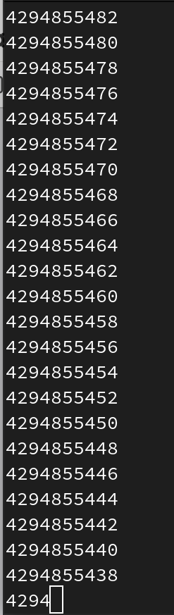

---
## Front matter
title: "Отчёт по лабораторной работе №8"
subtitle: "Дисциплина: Архитектура компьютера"
author: "Филатов Илья Гурамович"
 
## Generic otions
lang: ru-RU
toc-title: "Содержание"
 
## Bibliography
bibliography: bib/cite.bib
csl: pandoc/csl/gost-r-7-0-5-2008-numeric.csl
 
## Pdf output format
toc: true # Table of contents
toc-depth: 2
lof: true # List of figures
fontsize: 12pt
linestretch: 1.5
papersize: a4
documentclass: scrreprt
## I18n polyglossia
polyglossia-lang:
  name: russian
  options:
    - spelling=modern
    - babelshorthands=true
polyglossia-otherlangs:
  name: english
## I18n babel
babel-lang: russian
babel-otherlangs: english
## Fonts
mainfont: IBM Plex Serif
romanfont: IBM Plex Serif
sansfont: IBM Plex Sans
monofont: IBM Plex Mono
mathfont: STIX Two Math
mainfontoptions: Ligatures=Common,Ligatures=TeX,Scale=0.94
romanfontoptions: Ligatures=Common,Ligatures=TeX,Scale=0.94
sansfontoptions: Ligatures=Common,Ligatures=TeX,Scale=MatchLowercase,Scale=0.94
monofontoptions: Scale=MatchLowercase,Scale=0.94,FakeStretch=0.9
mathfontoptions:
## Biblatex
biblatex: true
biblio-style: "gost-numeric"
biblatexoptions:
  - parentracker=true
  - backend=biber
  - hyperref=auto
  - language=auto
  - autolang=other*
  - citestyle=gost-numeric
## Pandoc-crossref LaTeX customization
figureTitle: "Рис."
tableTitle: "Таблица"
listingTitle: "Листинг"
lofTitle: "Список иллюстраций"
lotTitle: "Список таблиц"
lolTitle: "Листинги"
## Misc options
indent: true
header-includes:
  - \usepackage{indentfirst}
  - \usepackage{float} # keep figures where there are in the text
  - \floatplacement{figure}{H} # keep figures where there are in the text
---
 
# Цель работы
 
Приобрести навыки написания программ с использованием циклов и обработкой аргументов командной строки.
 
 
# Задание
 
1. Реализация циклов в NASM
2. Обработка аргументов командной строки
3. Задание для самостоятельной работы
 
# Теоретическое введение
 
Стек — это структура данных, организованная по принципу LIFO («Last In — First Out» или «последним пришёл — первым ушёл»). Стек является частью архитектуры процессора и
реализован на аппаратном уровне. Для работы со стеком в процессоре есть специальные
регистры (ss, bp, sp) и команды.

Основной функцией стека является функция сохранения адресов возврата и передачи
аргументов при вызове процедур. Кроме того, в нём выделяется память для локальных
переменных и могут временно храниться значения регистров.

Стек имеет вершину, адрес последнего добавленного элемента, который хранится в регистре esp (указатель стека). Противоположный конец стека называется дном. Значение,
помещённое в стек последним, извлекается первым. При помещении значения в стек указатель стека уменьшается, а при извлечении — увеличивается.
Для стека существует две основные операции:

• добавление элемента в вершину стека (push);

• извлечение элемента из вершины стека (pop).

Команда push размещает значение в стеке, т.е. помещает значение в ячейку памяти, на
которую указывает регистр esp, после этого значение регистра esp увеличивается на 4.
Данная команда имеет один операнд — значение, которое необходимо поместить в стек.

Существует ещё две команды для добавления значений в стек. Это команда pusha, которая
помещает в стек содержимое всех регистров общего назначения в следующем порядке: ах,
сх, dx, bх, sp, bp, si, di. А также команда pushf, которая служит для перемещения в стек
содержимого регистра флагов. Обе эти команды не имеют операндов.

Команда pop извлекает значение из стека, т.е. извлекает значение из ячейки памяти, на
которую указывает регистр esp, после этого уменьшает значение регистра esp на 4. У этой
команды также один операнд, который может быть регистром или переменной в памяти.

Нужно помнить, что извлечённый из стека элемент не стирается из памяти и остаётся как
“мусор”, который будет перезаписан при записи нового значения в стек.

Аналогично команде записи в стек существует команда popa, которая восстанавливает
из стека все регистры общего назначения, и команда popf для перемещения значений из
вершины стека в регистр флагов.

Для организации циклов существуют специальные инструкции. Для всех инструкций
максимальное количество проходов задаётся в регистре ecx. Наиболее простой является инструкция loop.

Иструкция loop выполняется в два этапа. Сначала из регистра ecx вычитается единица и
его значение сравнивается с нулём. Если регистр не равен нулю, то выполняется переход к
указанной метке. Иначе переход не выполняется и управление передаётся команде, которая
следует сразу после команды loop.

# Выполнение лабораторной работы
 
## Реализация циклов в NASM
 
Открываю терминал. Создаю каталог для работы lab08 и перехожу в него. Создаю в нём файл lab8-1.asm (рис. [-@fig:001]).
 
{ #fig:001 width=70% }
 
Открываю файл с помощью редактора gedit и ввожу текст программы из листинга 8.1 (рис. [-@fig:002]).
 
{ #fig:002 width=70% }
 
Чтобы программа, которая содержит подпрограммы из in_out.asm, работала корректно, копирую этот файл из каталога lab07 в каталог lab08 (рис. [-@fig:003]).
 
{ #fig:003 width=70% }
 
Создаю исполняемый файл и проверяю его работу (рис. [-@fig:004]).
 
{ #fig:004 width=70% }
 
При этом, для не отрицательных значений только при N=0 программа работает некорректно (рис. [-@fig:005]).
 
{ #fig:005 width=70% }
 
Открываю текст программы и меняю его, добавляя значение регистра ecx в цикле (рис. [-@fig:006]).
 
{ #fig:006 width=70% }
 
Создаю и запускаю исполняемый файл. Он работает при чётных неотрицательных значениях N, а число проходов цикла в 2 раза меньше этого значения (рис. [-@fig:007]).
 
{ #fig:007 width=70% }
 
Эта программа работает некорректно при нечётных неотрицательных значениях (рис. [-@fig:008]).
 
{ #fig:008 width=70% }

Вношу изменения в текст программы, добавив команды push и pop (рис. [-@fig:009]).
 
{ #fig:009 width=70% }
 
Создаю исполняемый файл и проверяю его работу. В данном случае число проходов соответствует значению N (рис. [-@fig:010]).
 
{ #fig:010 width=70% }

## Обработка аргументов командной строки
 
Создаю файл lab8-2.asm в каталоге ~/work/arch-pc/lab08 и открываю его с помощью редактора gedit (рис. [-@fig:011]).
 
{ #fig:011 width=70% }
 
Ввожу текст программы из листинга 8.2 (рис. [-@fig:012]).
 
{ #fig:012 width=70% }
 
Создаю и запускаю исполняемый файл. Он обрабатывает все 3 аргумента (рис. [-@fig:013]).
 
{ #fig:013 width=70% }
 
Создаю файл lab8-3.asm в каталоге ~/work/arch-pc/lab08 и открываю его с помощью редактора gedit (рис. [-@fig:014]).
 
{ #fig:014 width=70% }

Ввожу текст программы из листинга 8.3 (рис. [-@fig:015]).
 
{ #fig:015 width=70% }
 
Создаю и запускаю исполняемый файл для нахождения суммы чисел (рис. [-@fig:016]).
 
{ #fig:016 width=70% }

Открываю текст программы и меняю его для вычисления произведения чисел (рис. [-@fig:017]).
 
{ #fig:017 width=70% }

Текст программы:

%include 'in_out.asm'

SECTION .data

msg db "Результат: ",0

SECTION .text

global _start

_start:

pop ecx ; Извлекаем из стека в `ecx` количество

; аргументов (первое значение в стеке)

pop edx ; Извлекаем из стека в `edx` имя программы

; (второе значение в стеке)

sub ecx,1 ; Уменьшаем `ecx` на 1 (количество

; аргументов без названия программы)

mov esi, 1 ; Используем `esi` для хранения

; промежуточных произведений

next:

cmp ecx,0h ; проверяем, есть ли еще аргументы

jz _end ; если аргументов нет выходим из цикла

; (переход на метку `_end`)

pop eax ; иначе извлекаем следующий аргумент из стека

call atoi ; преобразуем символ в число

imul esi,eax ; умножаем на промежуточное произведение

; след. аргумент `esi=esi*eax`

loop next ; переход к обработке следующего аргумента

_end:

mov eax, msg ; вывод сообщения "Результат: "

call sprint

mov eax, esi ; записываем произведение в регистр `eax`

call iprintLF ; печать результата

call quit ; завершение программы

Создаю исполняемый файл и проверяю его (рис. [-@fig:018]).
 
{ #fig:018 width=70% }

Создаю файл lab8-4.asm в каталоге ~/work/arch-pc/lab08 и открываю его с помощью редактора gedit (рис. [-@fig:019]).
 
{ #fig:019 width=70% }

## Задание для самостоятельной работы
 
Пишу программу для нахождения суммы значений функции 3(x+2) из варианта 7 (рис. [-@fig:020]).
 
{ #fig:020 width=70% }

Текст программы:

%include 'in_out.asm'

SECTION .data

msg db "Результат: ",0

SECTION .text

global _start

_start:

pop ecx ; Извлекаем из стека в `ecx` количество

; аргументов (первое значение в стеке)

pop edx ; Извлекаем из стека в `edx` имя программы

; (второе значение в стеке)

sub ecx,1 ; Уменьшаем `ecx` на 1 (количество

; аргументов без названия программы)

mov esi, 0 ; Используем `esi` для хранения

; промежуточных сумм

next:

cmp ecx,0h ; проверяем, есть ли еще аргументы

jz _end ; если аргументов нет выходим из цикла

; (переход на метку `_end`)

pop eax ; иначе извлекаем следующий аргумент из стека

call atoi ; преобразуем символ в число

add eax, 2; eax=x+2

imul eax, 3; eax=3*(x+2)

add esi,eax ; добавляем к промежуточной сумме

; след. аргумент `esi=esi+eax`

loop next ; переход к обработке следующего аргумента

_end:

mov eax, msg ; вывод сообщения "Результат: "

call sprint

mov eax, esi ; записываем сумму в регистр `eax`

call iprintLF ; печать результата

call quit ; завершение программы

Создаю исполняемый файл и проверяю его (рис. [-@fig:021]).
 
{ #fig:021 width=70% }

# Выводы
 
Я приобрёл навыки написания программ с использованием циклов и обработкой аргументов командной строки.
 
# Список литературы
 
1. [Архитектура ЭВМ](https://esystem.rudn.ru/pluginfile.php/2089548/mod_resource/content/0/%D0%9B%D0%B0%D0%B1%D0%BE%D1%80%D0%B0%D1%82%D0%BE%D1%80%D0%BD%D0%B0%D1%8F%20%D1%80%D0%B0%D0%B1%D0%BE%D1%82%D0%B0%20%E2%84%968.%20%D0%9F%D1%80%D0%BE%D0%B3%D1%80%D0%B0%D0%BC%D0%BC%D0%B8%D1%80%D0%BE%D0%B2%D0%B0%D0%BD%D0%B8%D0%B5%20%D1%86%D0%B8%D0%BA%D0%BB%D0%B0.%20%D0%9E%D0%B1%D1%80%D0%B0%D0%B1%D0%BE%D1%82%D0%BA%D0%B0%20%D0%B0%D1%80%D0%B3%D1%83%D0%BC%D0%B5%D0%BD%D1%82%D0%BE%D0%B2%20%D0%BA%D0%BE%D0%BC%D0%B0%D0%BD%D0%B4%D0%BD%D0%BE%D0%B9%20%D1%81%D1%82%D1%80%D0%BE%D0%BA%D0%B8..pdf)